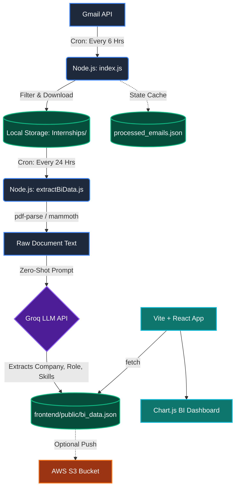

# Internship Intelligence & Automation System

An end-to-end automated pipeline that monitors university placement emails, uses a Large Language Model (LLM) to intelligently extract job details and required tech skills from email attachments, and visualizes the hiring trends on a sleek React BI Dashboard.

## 🏗️ Architecture



## ✨ Features

- **Automated Email Scraping**: Continuously monitors a Gmail inbox for placement-related emails, strictly querying the last 24-hours of emails via dynamic timestamps to prevent rate limiting.
- **Local Document Parsing**: Uses native Node.js libraries (`pdf-parse`, `mammoth`) to silently rip text from downloaded `.pdf` and `.docx` attachments without needing external conversion APIs.
- **AI-Powered Data Extraction**: Leverages the Groq API (running `llama` / `qwen` models) for blazing-fast zero-shot classification to verify B.Tech CSE eligibility, extract the hiring company, the specific job role, and an array of required tech skills.
- **Amazon S3 Integration**: Automatically synchronizes extracted data to an AWS S3 bucket, creating a reliable and highly available storage backend optimized for autonomous, scheduled deployment via EC2 Cron jobs.
- **Modern React Frontend**: A completely decoupled Vite + React application that renders interactive Doughnut and Bar charts (via `react-chartjs-2`), providing instant visualization of hiring trends and "hot skills".

## 🛠️ Tech Stack

- **Backend**: Node.js, Gmail API, Groq-SDK
- **Parsing**: `pdf-parse`, `mammoth`
- **Frontend**: React.js, Vite, Chart.js, Vanilla CSS (Glassmorphism UI)
- **Deployment**: AWS EC2 (Linux Cron Jobs)

## 📁 Directory Structure

```text
.
├── Internships/                 # Downloaded JD PDFs, DOCXs, and TXTs
├── frontend/                    # Decoupled React + Vite Web Application
│   ├── public/                  
│   │   └── bi_data.json         # LLM JSON output (Database for frontend)
│   ├── src/
│   │   ├── App.jsx              # Main Dashboard Logic & Fetch
│   │   └── App.css              # Dark-mode Premium UI Styling
├── src/
│   ├── ai/
│   │   └── classifier.js        # Groq LLM extraction prompts & schemas
│   ├── bi/
│   │   └── extractBiData.js     # Reads local docs, queries LLM, updates bi_data.json
│   ├── gmail/
│   │   └── gmailClient.js       # Gmail API authentication and queries
│   └── index.js                 # Entry point for the 6-hour email fetcher
├── processed_emails.json        # Cache for processed email IDs
├── unprocessed_emails.json      # Queue for rate-limited emails
└── .env                         # Environment keys (Groq, Gmail, Ports)
```

## 🚀 Setup & Execution

### 1. Environment Variables
Create a `.env` file in the root directory:
```env
GROQ_API_KEY=your_groq_api_key
INTERNSHIP_FOLDER=Internships
```
*(Ensure `token.json` and `credentials.json` for Google Cloud are present for the Gmail API).*

### 2. Running the Backend Extractors
```bash
# 1. Fetch recent emails and download documents
node src/index.js

# 2. Extract Data from downloaded documents to feed the BI dashboard
node src/bi/extractBiData.js
```
*Note: In production on AWS EC2, these two scripts are scheduled via Cron (e.g., `index.js` every 6 hours, `extractBiData.js` every 24 hours).*

### 3. Launching the BI Dashboard
```bash
cd frontend
npm install
npm run dev
```
Navigate to `http://localhost:5173`. Click the **Refresh Data** button to dynamically load the latest insights from `bi_data.json`.
